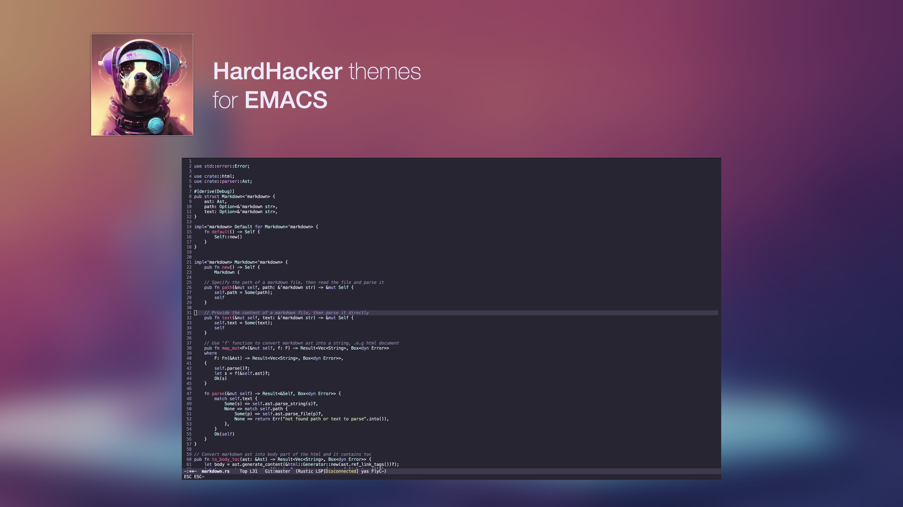

<p align="center">
  
</p>

<h1 align="center">
  HardHacker Theme for Emacs
</h1>



## Install 

### Manually

```bash
git clone https://github.com/hardhackerlabs/theme-emacs.git 
cp ./theme-emacs/hardhacker-theme.el ~/.emacs.d/themes/
```

Add the following configuration to your `init.el`, then restart emacs.

```lisp
(add-to-list 'custom-theme-load-path "~/.emacs.d/themes")
(load-theme 'hardhacker t)
```
